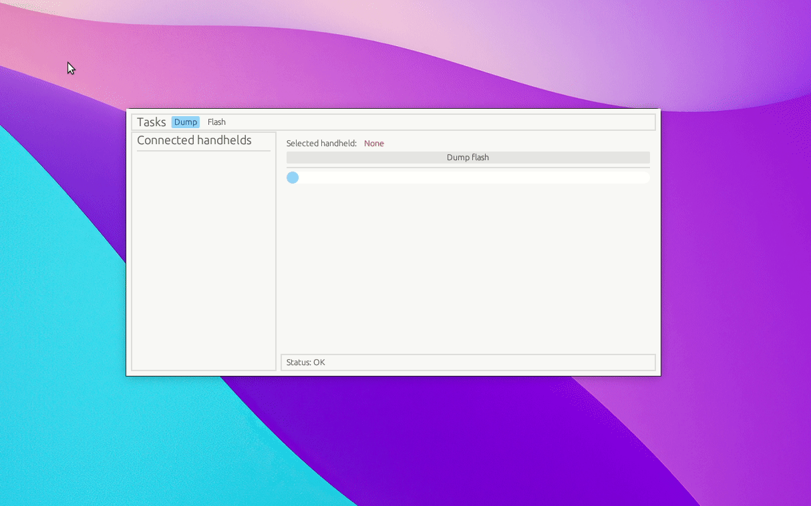

# Miuchiz Recovery

## Overview

This is a tool for reading and writing to the flash of a [Miuchiz handheld device](https://miuchiz.com/overview). It operates as a GUI frontend to libmiuchiz-usb, part of [Native-Miuchiz-Handheld-USB-Utilities](https://github.com/ChrisMiuchiz/Native-Miuchiz-Handheld-USB-Utilities/).

## Attaching a Miuchiz handheld device

A Miuchiz handheld device must be in "PC mode" to attach to a computer via USB. For devices running 1.X firmware, PC mode can be entered in any of the following ways:

1) Walking to and using the computer ingame.
2) Holding LEFT + MENU while booting the device [1].
3) Holding UP + DOWN + LEFT + RIGHT while booting the device [1]. This is physically impossible without taking the device apart. 
4) Powering on the device while the first 4 bytes of flash are in an unexpected state. This is not useful for most users, but is worth documenting.

[1]: "Booting the device" does not happen upon pressing the POWER button. This button is only used to put it into a low-power state. Booting the device can be done by pressing RESET, inserting batteries, or plugging it into a USB power source while batteries are not inside the device.

---

